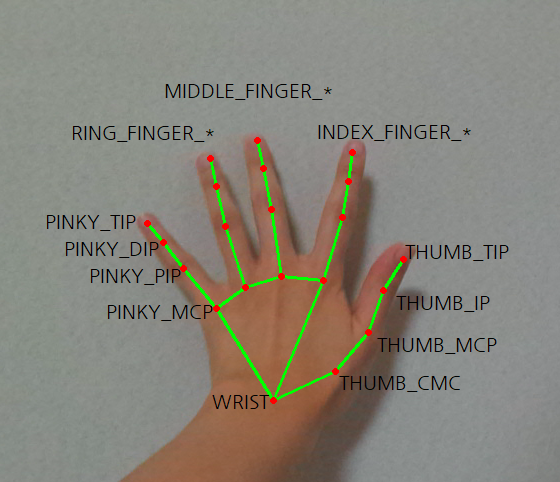
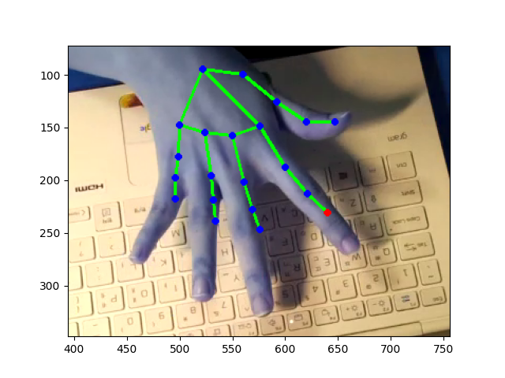
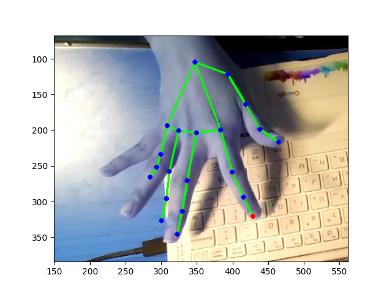
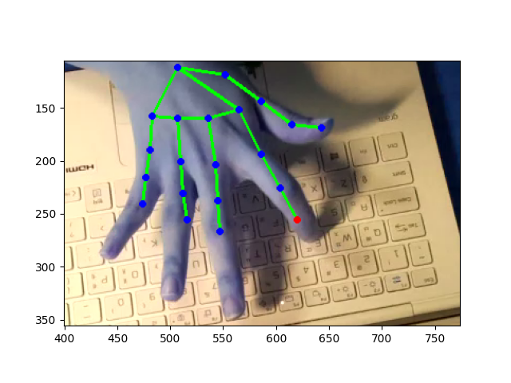

# hand-tracking-motion-recognize

키보드 자판, 피아노 등의 영역에서 영상 속 손가락이 어떤 위치(ex. 자판의 spacebar를 눌렀는지, Q키를 눌렀는지 등)을 누르는지를 트래킹하는 소프트웨어입니다.

트래킹할 관절 위치 이미지

### 사용하는 SW
1. opencv,
2. mediapipe,
3. google colab.

### 출력 이미지

스켈레톤을 잘못 판단한 경우

스켈레톤을 잘 파악하고, 자판을 제대로 인식한 경우

스켈레톤을 잘 파악했지만, 눌린 자판을 제대로 인식하지 못한 경우

